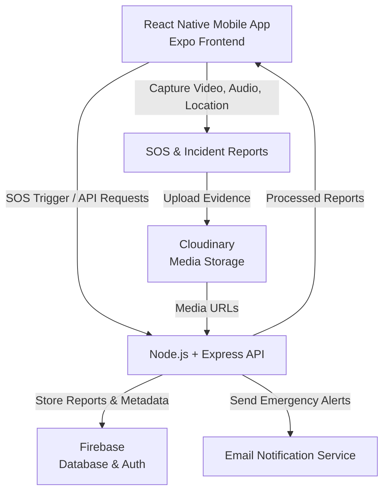
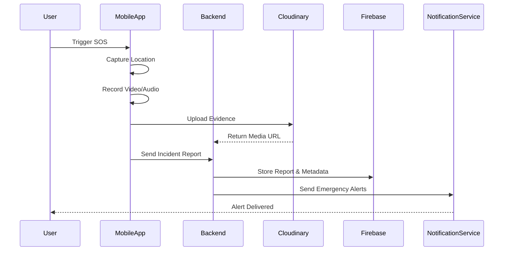

# Abhaya - Women Safety App

Abhaya is a women safety mobile application built using React Native and Expo.  
The app focuses on emergency assistance, SOS alerts, real-time location support, incident reporting, and video evidence storage.

The main goal of Abhaya is to provide a quick and reliable safety solution during emergency situations by allowing users to trigger SOS, capture evidence, generate incident reports, and notify emergency contacts.

---

## Project Overview

Abhaya is designed to help users during unsafe or emergency situations.  
When the user triggers SOS, the app can start the emergency workflow, capture important evidence, upload video proof, generate an incident report, and send alert information to emergency contacts.

The project contains both:

- Mobile frontend built with Expo React Native
- Backend API built with Node.js and Express.js

---

## Features

### User Authentication

- User signup
- User login
- Profile management
- Token-based authentication flow

### SOS Emergency System

- SOS trigger from the mobile app
- Emergency workflow activation
- Alert/report generation

### Evidence Recording

- Camera and microphone access
- Video evidence recording
- Evidence upload support
- Evidence video viewing inside the app

### Incident Report

- Automatic incident report generation
- Report details screen
- Evidence URL attached with report
- Report storage and retrieval support

### Location and Map Support

- Location access using Expo Location
- Map integration
- Location-based safety workflow support

### Cloud Storage

- Cloudinary integration for video evidence upload
- Firebase integration for backend-side data handling

### Alert System

- Email alert support using Nodemailer
- Backend API for sending emergency alerts
- Twilio support available in backend dependencies

### Deployment Support

- Expo app build support using EAS
- Backend deployment support using Render
- Environment-based configuration

---

## Tech Stack

### Frontend

- React Native
- Expo
- JavaScript
- React Navigation
- Expo Camera
- Expo Location
- Expo Video
- Expo AV
- React Native Maps
- AsyncStorage
- Firebase Client SDK
- Expo Linear Gradient

### Backend

- Node.js
- Express.js
- Firebase Admin SDK
- Nodemailer
- Multer
- Twilio
- CORS
- Dotenv
- Nodemon

### Cloud and Services

- Firebase
- Cloudinary
- Gmail SMTP / Nodemailer
- Render
- EAS Build
- GitHub

---
## System Architecture

### High-Level Overview

Abhaya follows a client-server architecture where the mobile application communicates with a backend API responsible for evidence management, report generation, and emergency notifications.



---

### SOS Workflow



---

### Component Responsibilities

#### Mobile Application (React Native + Expo)

Responsible for:

- SOS triggering
- Camera and audio recording
- Real-time location tracking
- User interaction and navigation
- Report viewing and evidence access

#### Backend API (Node.js + Express)

Responsible for:

- Report processing
- Notification orchestration
- Media upload coordination
- Database communication
- Business logic and API handling

#### Firebase

Used for:

- report storage
- metadata persistence
- authentication support

#### Cloudinary

Used for:

- video/audio evidence storage
- optimized media delivery
- CDN-based retrieval

#### Notification Services

Used for:

- emergency email alerts
- escalation workflows

---

### Why This Architecture

This architecture separates frontend and backend responsibilities, making the system:

- scalable
- maintainable
- easier to extend
- contributor-friendly

It also allows media handling, emergency communication, and report management to remain modular and independently manageable.
```

---
## Project Structure

```bash
Abhaya/
│
├── assets/                  # App images and static assets
├── backend/                 # Node.js Express backend
├── context/                 # React context files
├── ffdemo/                  # Demo/extra project files
├── screens/                 # App screens
├── services/                # API and helper services
│
├── App.js                   # Main app component
├── app.json                 # Expo app configuration
├── eas.json                 # EAS build configuration
├── index.js                 # App entry point
├── package.json             # Frontend dependencies
├── package-lock.json
├── .env.example             # Example frontend environment variables
├── .gitignore
└── README.md
